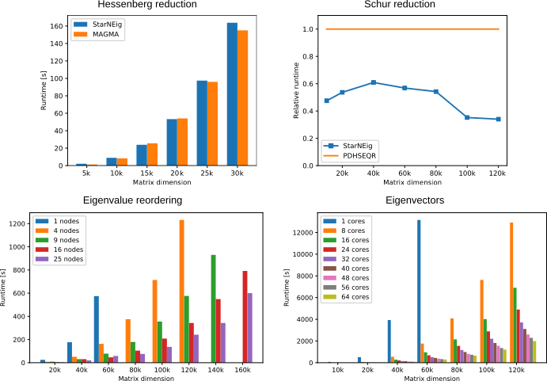

## About the library

[StarNEig](cpe.5915.pdf) library aims to provide a complete task-based software
stack for solving **dense** **nonsymmetric** (generalized) eigenvalue problems.
The library is built on top of the [StarPU](http://starpu.gforge.inria.fr/)
runtime system and targets both **shared memory** and **distributed memory**
machines. Some components of the library support **GPUs**.

The four main components of the library are:

 - **Hessenberg(-triangular) reduction**: A dense matrix (or a dense matrix
   pair) is reduced to upper Hessenberg (or Hessenberg-triangular) form.
 - **Schur reduction (QR/QZ algorithm)**: A upper Hessenberg matrix (or a
   Hessenberg-triangular matrix pair) is reduced to (generalized) Schur form.
   The (generalized) eigenvalues can be determined from the diagonal blocks.
 - **Eigenvalue reordering and deflating subspaces**: Reorders a user-selected
   set of (generalized) eigenvalues to the upper left corner of an updated
   (generalized) Schur form.
 - **Computation of eigenvectors**: Computes (generalized) eigenvectors for a
   user-selected set of (generalized) eigenvalues.

The library has been developed as a part of the [NLAFET](https://www.nlafet.eu/)
project. The project has received funding from the European Union’s Horizon 2020
research and innovation programme under grant agreement No. 671633. Support has
also been received from eSSENCE, a collaborative e-Science programme funded by
the Swedish Government via the Swedish Research Council (VR), and VR Grant
E0485301. The development and performance evaluations were performed on
resources provided by the Swedish National Infrastructure for Computing (SNIC)
at HPC2N partially funded by VR through grant agreement No. 2016-07213. The 
library is published under the open-source BSD 3-Clause license.

Please cite the following article when referring to StarNEig:
> Mirko Myllykoski, Carl Christian Kjelgaard Mikkelsen: *Task-based,
> GPU-accelerated and Robust Library for Solving Dense Nonsymmetric Eigenvalue
> Problems*, Concurrency and Computation: Practice and Experience, 2020,
> doi: [10.1002/cpe.5915](https://doi.org/10.1002/cpe.5915)

## Performance

Performance comparisons against MAGMA (GPU) and ScaLAPACK (distributed memory),
and strong scalability on shared and distributed memory machines:

Also, see following publications:

 - Mirko Myllykoski: *A Task-based Multi-shift QR/QZ Algorithm with Aggressive
   Early Deflation*, [arXiv:2007.03576](https://arxiv.org/abs/2007.03576)
 - Mirko Myllykoski, Carl Christian Kjelgaard Mikkelsen: *Task-based,
   GPU-accelerated and Robust Library for Solving Dense Nonsymmetric Eigenvalue
   Problems*, Concurrency and Computation: Practice and Experience, 2020,
   doi: [10.1002/cpe.5915](https://doi.org/10.1002/cpe.5915)
 - Mirko Myllykoski, Carl Christian Kjelgaard Mikkelsen, Angelika Schwarz,
   Bo Kågström: *D2.7 Eigenvalue solvers for nonsymmetric problems*, public
   NLAFET deliverable, 2019
   ([download](D2.7-EVP-solvers-evaluation-final.pdf))

## Current status

The stable 0.1-series currently supports only real arithmetic (real input and
output matrices but **real and/or complex** eigenvalues and eigenvectors). In
addition, some interface functions are implemented as LAPACK and ScaLAPACK
wrapper functions.

Standard eigenvalue problems:

|                  |  Shared memory  | Distributed memory |      CUDA      |
|------------------|:---------------:|:------------------:|:--------------:|
| **Hessenberg**   |   *Complete*    |      ScaLAPACK     |  *Single GPU*  |
| **Schur**        |   *Complete*    |     *Complete*     | *Experimental* |
| **Reordering**   |   *Complete*    |     *Complete*     | *Experimental* |
| **Eigenvectors** |   *Complete*    |        ---         |      ---       |

Generalized eigenvalue problems:

|                  |  Shared memory  | Distributed memory |      CUDA      |
|------------------|:---------------:|:------------------:|:--------------:|
| **Hessenberg**   |     LAPACK      |     3rd party      |      ---       |
| **Schur**        |   *Complete*    |     *Complete*     | *Experimental* |
| **Reordering**   |   *Complete*    |     *Complete*     | *Experimental* |
| **Eigenvectors** |   *Complete*    |        ---         |      ---       |

## Authors

StarNEig has been developed at the Department of Computing Science of Umeå
University, Sweden.The following people have contributed to the library:

 - Angelika Schwarz
    - Standard eigenvectors
 - Bo Kågström
    - Coordinator and scientific director for the NLAFET project
    - Documentation
 - Carl Christian Kjelgaard Mikkelsen
    - Generalized eigenvectors
 - Lars Karlsson
    - Application programming interface
    - Documentation
 - Mirko Myllykoski
    - Hessenberg reduction
    - Schur reduction (standard and generalized)
    - Eigenvalue reordering (standard and generalized)
    - Application programming interface
    - Test program
    - Documentation

## Download and documentation

The stable 0.1-series is recommended for most users:

 - [Version 0.1 branch](https://github.com/NLAFET/StarNEig/tree/v0.1) (
    [pdf](https://nlafet.github.io/StarNEig/v0.1/starneig_manual.pdf),
    [html](https://nlafet.github.io/StarNEig/v0.1/html/)
    )
 - [Releases](https://github.com/NLAFET/StarNEig/releases/):
   - [Version 0.1.5](https://github.com/NLAFET/StarNEig/releases/tag/v0.1.5) (
     [pdf](https://nlafet.github.io/StarNEig/v0.1.5/starneig_manual.pdf),
     [html](https://nlafet.github.io/StarNEig/v0.1.5/html/)
     )
   - [Version 0.1.4](https://github.com/NLAFET/StarNEig/releases/tag/v0.1.4) (
     [pdf](https://nlafet.github.io/StarNEig/v0.1.4/starneig_manual.pdf),
     [html](https://nlafet.github.io/StarNEig/v0.1.4/html/)
     )
     **NEW!** Prebuild packages for Ubuntu 18.04/20.04.
   - [Version 0.1.3](https://github.com/NLAFET/StarNEig/releases/tag/v0.1.3) (
     [pdf](https://nlafet.github.io/StarNEig/v0.1.3/starneig_manual.pdf),
     [html](https://nlafet.github.io/StarNEig/v0.1.3/html/)
     ) 
     **NEW!** Improved Hessenberg reduction.
   - [Version 0.1.2](https://github.com/NLAFET/StarNEig/releases/tag/v0.1.2) (
     [pdf](https://nlafet.github.io/StarNEig/v0.1.2/starneig_manual.pdf),
     [html](https://nlafet.github.io/StarNEig/v0.1.2/html/)
     )
   - [Version 0.1.1](https://github.com/NLAFET/StarNEig/releases/tag/v0.1.1) (
     [pdf](https://nlafet.github.io/StarNEig/v0.1.1/starneig_manual.pdf),
     [html](https://nlafet.github.io/StarNEig/v0.1.1/html/)
     )
     **NEW!** Major bug fix (stall).
   - [Version 0.1.0](https://github.com/NLAFET/StarNEig/releases/tag/v0.1.0) (
     [pdf](https://nlafet.github.io/StarNEig/v0.1.0/starneig_manual.pdf),
     [html](https://nlafet.github.io/StarNEig/v0.1.0/html/)
     )
 - Beta releases:
   - [Version 0.1-beta.6](https://github.com/NLAFET/StarNEig/releases/tag/v0.1-beta.6) (
     [pdf](https://nlafet.github.io/StarNEig/v0.1-beta.6/starneig_manual.pdf),
     [html](https://nlafet.github.io/StarNEig/v0.1-beta.6/html/)
     )
   - [Version 0.1-beta.5](https://github.com/NLAFET/StarNEig/releases/tag/v0.1-beta.5) (
     [pdf](https://nlafet.github.io/StarNEig/v0.1-beta.5/starneig_manual.pdf),
     [html](https://nlafet.github.io/StarNEig/v0.1-beta.5/html/)
     )
   - [Version 0.1-beta.4](https://github.com/NLAFET/StarNEig/releases/tag/v0.1-beta.4) (
     [pdf](https://nlafet.github.io/StarNEig/v0.1-beta.4/starneig_manual.pdf),
     [html](https://nlafet.github.io/StarNEig/v0.1-beta.4/html/)
     )
   - [Version 0.1-beta.3](https://github.com/NLAFET/StarNEig/releases/tag/v0.1-beta.3) (
     [pdf](https://nlafet.github.io/StarNEig/v0.1-beta.3/starneig_manual.pdf),
     [html](https://nlafet.github.io/StarNEig/v0.1-beta.3/html/)
     )
   - [Version 0.1-beta.2](https://github.com/NLAFET/StarNEig/releases/tag/v0.1-beta.2) (
     [pdf](https://nlafet.github.io/StarNEig/v0.1-beta.2/starneig_manual.pdf),
     [html](https://nlafet.github.io/StarNEig/v0.1-beta.2/html/)
     )
   - [Version 0.1-beta.1](https://github.com/NLAFET/StarNEig/releases/tag/v0.1-beta.1) (
     [pdf](https://nlafet.github.io/StarNEig/v0.1-beta.1/starneig_manual.pdf),
     [html](https://nlafet.github.io/StarNEig/v0.1-beta.1/html/)
     )

The development series is under continuous development and considered
**unstable**:

 - [Master branch](https://github.com/NLAFET/StarNEig/tree/master) (
    [pdf](https://nlafet.github.io/StarNEig/master/starneig_manual.pdf),
    [html](https://nlafet.github.io/StarNEig/master/html/)
    )
